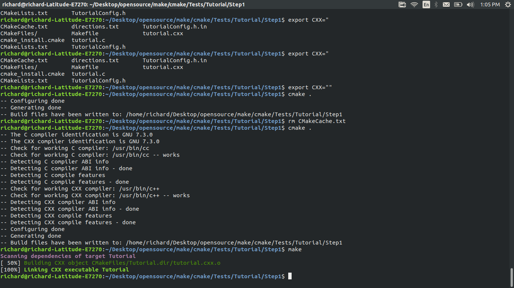
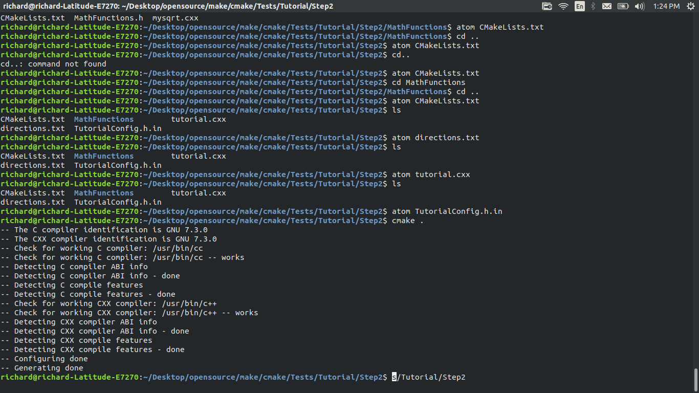
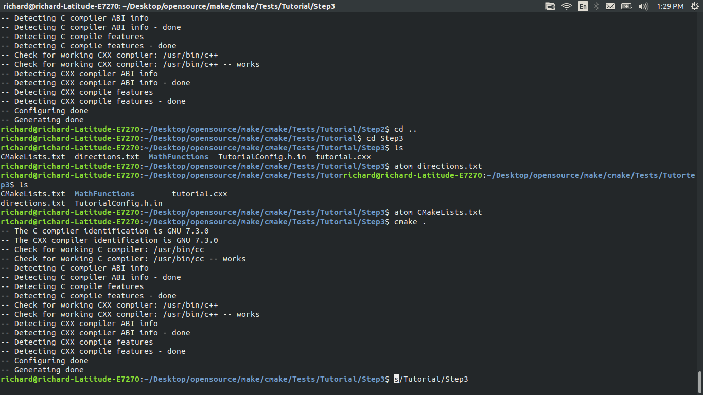
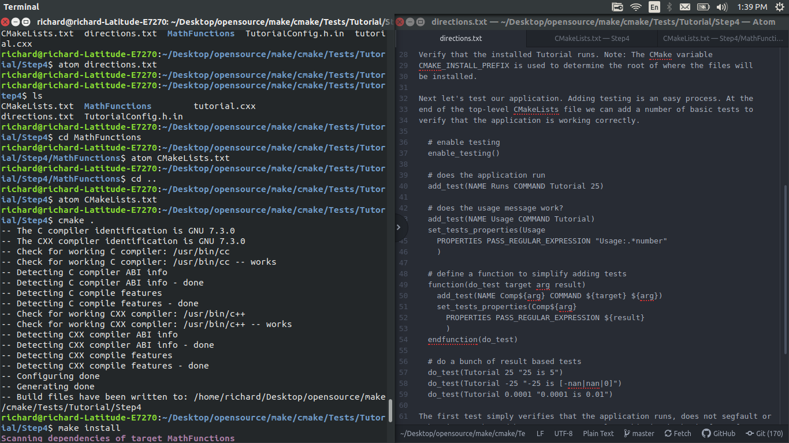
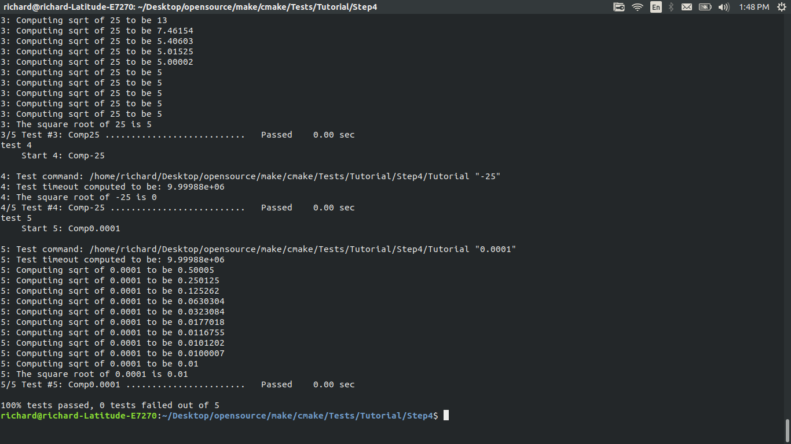
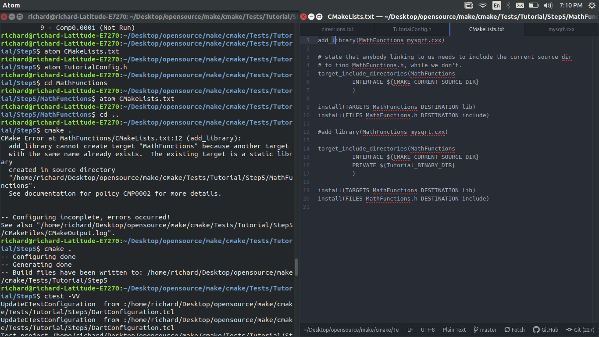
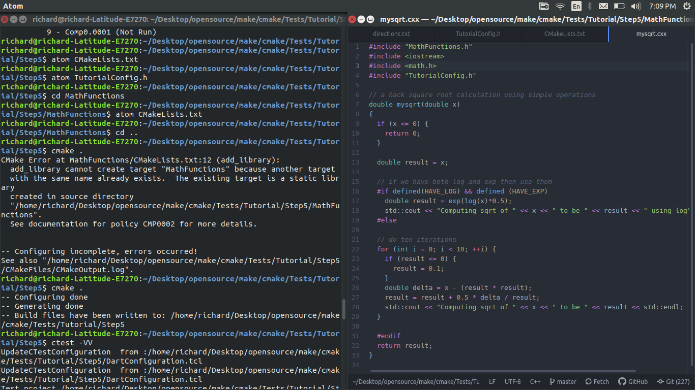
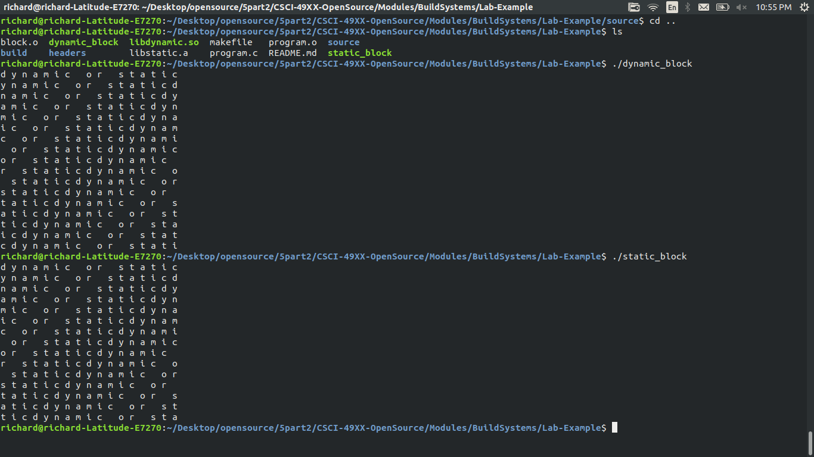

# Lab5

## Step 1:  
  

## Step 2:
  

## Step 3:
  

## Step 4:
  
  

## Step 5:
  
  

Step 5's sqrt now gives better results than Step1's sqrt

If we inverted the two, it would not build right. It needs files that it is not aware of yet.  
We could save HAVE_LOG and HAVE_EXP in dedicated files

## Make File:  

all:static_block dynamic_block  

static_block:program.o libstatic.a  
	cc -lm -o static_block program.o libstatic.a -L. -lstatic  
dynamic_block:program.o libdynamic.so  
	cc program.o libdynamic.so -o dynamic_block -Wl,-rpath='$$ORIGIN'  

program.o:program.c headers/block.h  
	cc -O -c program.c  

libstatic.a:block.o  
	ar rcs libstatic.a block.o  

libdynamic.so:block.o  
	cc -shared -o libdynamic.so block.o  

block.o:source/block.c headers/block.h  
	cc -O -c source/block.c  

lib:libdynamic.so libstatic.a  

## CMakeLists:  

cmake_minimum_required(VERSION 3.0)  
project(dynamic)  
project(static)  
ADD_LIBRARY( MyStaticLib STATIC block.c )  
ADD_LIBRARY(MyDynaLib SHARED block.c)  
ADD_EXECUTABLE( dynamic ../program.c )  
ADD_EXECUTABLE(static ../program.c)  
TARGET_LINK_LIBRARIES(static MyStaticLib )  
TARGET_LINK_LIBRARIES(dynamic MyDynaLib)  

## CMake Make File  

[Link to file because it was too large](Makefile)

## Sizes

The sizes are about 9.0 kb apart. The Cmake one is far larger.

## Output

The outputs from the static and dynamic ones:  
  

